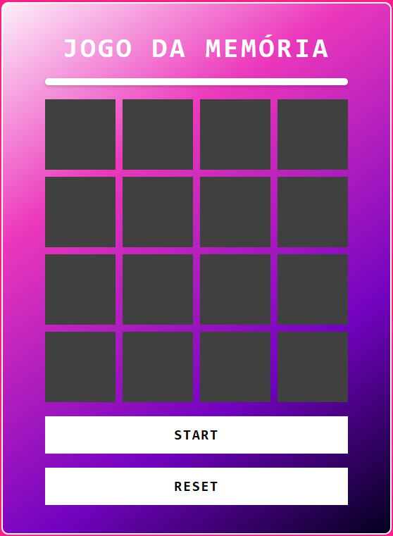
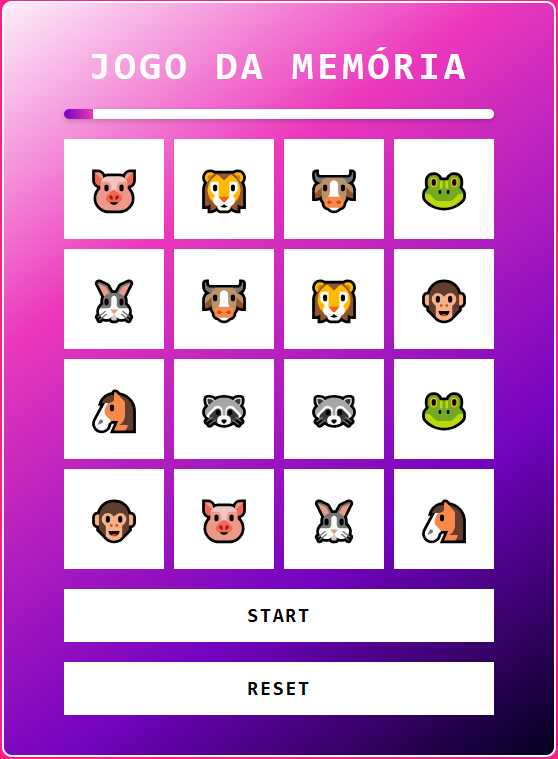

<h1>Desafio DIO - Jogo de Memória</h1>

<h2>Desafio realizado conforme as aulas com algumasadições pessoais como:</h2>
<ul>
<li>Botão de Start.</li>
<li>Animação de início.</li>
<li>Adição de sons de acerto, erro, fim de jogo(Vitória e Derrota).</li>
<li>Barra de tempo de jogo.</li>
</ul>

<h2>Telas do jogo</h2>

  
  

